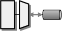

# Enterprise Integration Patterns

_This summary is intended purely as a reference to [the book](https://amzn.to/2vTmfS7)
and complies with the "copy up to 10% of the book" copyright law._

**Citation:** [Hohpe, G., & Woolf, B. (2012). Enterprise Integration Patterns. Addison-Wesley.](https://amzn.to/2vTmfS7)

This book is a foundational reference for Enterprise, application
integration design patterns. The book inspired a lot of the
implementations found in Service-Oriented Architecture and traditional,
enterprise Service Bus solutions as well as programming integration
frameworks like [Java Spring Integration](https://spring.io/projects/spring-integration).

## Read the Book

- [Amazon](https://amzn.to/2vTmfS7)

## Six Types of Integration

- Information portals

    

- Data replication

    

- Shared business functions

   

- Service-oriented architectures

    

- Distributed business processes

    

- Business-to-business integration

    

## Integration Styles

### Application Integration Criteria

- Application coupling
- Intrusiveness
- Technology selection
- Data format
- Data timeliness
- Data or functionality
- Remote Communication
- Reliability

### Application Integration Options

- File Transfer

    

- Shared Database

    

- Remote Procedure Invocation

    

- Messaging

    

## Messaging Systems

- Channels

    

- Messages

    

- Pipes and Filters

    

- Routing

    

- Transformation

    

- Endpoints

    

## Messaging Channels

### Message Channel Decisions

- One-to-one or one-to-many
- What type of data
- Invalid and dead messages
- Crash proof
- Non-messaging clients
- Communications backbone

- Point-to-point channel

    

- Publish-Subscribe channel

    

- Datatype channel

    

- Invalid message channel

    

- Dead letter channel

    

- Guaranteed delivery

    

- Channel adapter

    

  - User interface adapter
  - Business logic adapter
  - Database adapter

- Messaging bridge

    

- Message bus

    

## Messaging Construction

- Command message

    

- Document message

    

- Document message

    

- Event message

    

  - Push model: a combined document/event message
  - Pull model: three messages
    1. Update
    2. State request
    3. State reply

- Request-Reply

    

  1. Requestor
  2. Replier has two approaches to reply

      - Synchronous block
      - Asynchronous callback

        ... with three possible values:

      1. Void
      2. Result
      3. Exception

- Return address

    

- Correlation identifier

    

    Six parts:

    1. Requestor
    2. Replier
    3. Request
    4. Reply
    5. Request ID
    6. Correlation ID

- Message sequence

    

    Three identification fields:

    1. Sequence identifier
    2. Position identifier
    3. Size or End indicator

- Message expiration

    

- Format indicator

    1. Version number
    2. Foreign key
    3. Format document

## Message Routing

- Simple routers
- Composed routers
- Architectural patterns

- Content-based router

    

- Message filter

    

- Dynamic router

    

- Recipient list

    

- Splitter

    

- Aggregator

    

- Resequencer

    

- Composed message processor

    

- Routing slip

    

- Process manager

    

- Message broker

    

## Message Transformation

- Envelope wrapper

    

- Content enricher

    

- Content filter

    

- Claim check

    

- Normalizer

    

### Canonical data model

> The Canonical Data Model provides an additional level of indirection
between applications' individual data formats. If a new application
is added to the integration solution, only transformation between the
Canonical Data Model has to be created, regardless of the number of
applications that already participate.
>
> The use of a Canonical Data Model may seem overly complicated if only
a small number of applications participate in the integration solution.
However, the solution quickly pays off as the number of applications increases.

#### Transformation Options

1. Change the applications' internal data format
2. Implement a Messaging Mapper inside the application
3. Use an external Message Translator

#### Double Translation

> The use of a Canonical Data Model does introduce a certain amount of
overhead into the message flow. Each message now has to undergo two
translation steps instead of one: one translation from the source
application's format into the common format and one from the common
format into the target application's format.

## Message Endpoints

### Send and Receive Patterns

- Encapsulate the messaging code
- Data translation
- Externally controlled transactions

### Message Consumer Patterns

- Synchronous or asynchronous consumer
- Message assignment versus message grab
- Accept all messages or filter
- Subscribe while disconnected
- Idempotency
- Synchronous or asynchronous service

### Catalog

- Messaging gateway

    

  - Messaging mapper

- Transactional client

    

- Polling consumer

    

- Event-driven consumer

    

- Competing consumers

    

- Message dispatcher

    

    Two parts:

    1. Dispatcher
    2. Performer

- Selective consumer

    

- Durable subscriber

    

  - Idempotent Receiver

- Service activator

    

## System Management

### Categories

- Monitoring and Controlling
- Observing and Analyzing Message Traffic
- Testing and Debugging

### Catalog

- Control bus

    

- Detour

    

- Wire tap

    

- Message history

- Message store

    

- Smart proxy

    

- Test message

    

- Channel purger

    
